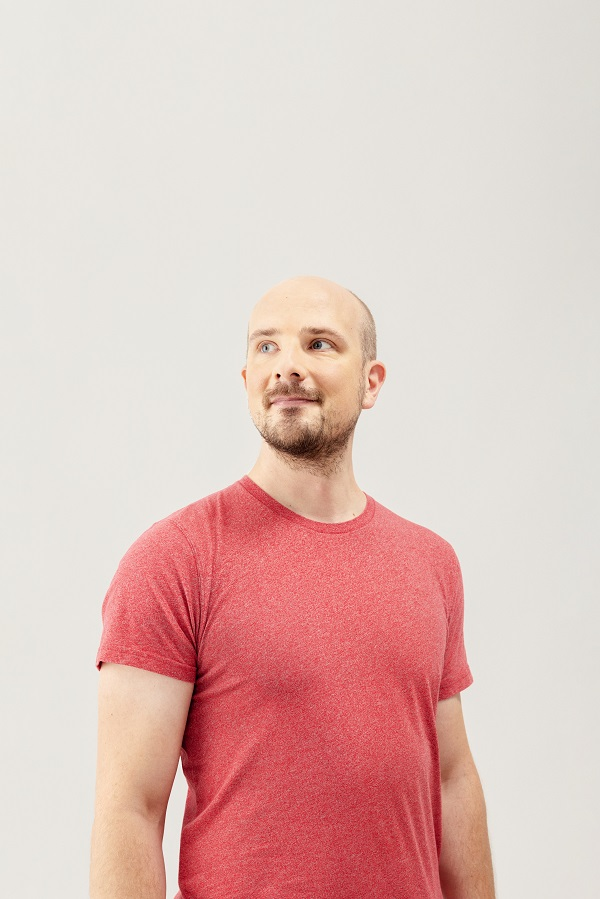

# SPEC: analyticsdev.net — Conference Website

## 1. Objective

Build a lightweight, static HTML/CSS website for **AnalyticsDev** — a code-first evening conference for technical digital analysts, implementation specialists, and data engineers. The site lives at `analyticsdev.net`, is hosted on GitHub Pages with a CNAME, and serves as the authoritative home for the conference: overview, program, speakers, sponsors, registration link, and event archive.

**Target users:**
- Potential attendees (technical professionals) discovering the event
- Past attendees looking up previous editions
- Sponsors checking their placement

**Primary goals:**
1. Communicate what AnalyticsDev is and who it's for
2. Show the current edition's program, speakers, and sponsors
3. Link out to registration (Billetto) and community (BrandLeadership Community)
4. Archive past editions as permanent, browsable pages

---

## 2. Site Structure

```
analyticsdev.net/
├── index.html            # Current/upcoming event landing page
├── CNAME                 # GitHub Pages custom domain: analyticsdev.net
├── css/
│   └── style.css         # All styles (single file, no build step)
├── assets/
│   ├── logo/
│   │   ├── image.png     # Current placeholder: BLC logo (replace with AnalyticsDev logo)
│   │   └── logo.svg      # Future: AnalyticsDev SVG logo
│   ├── sponsors/         # Sponsor logo files (SVG or PNG)
│   └── speakers/         # Speaker headshots (JPG/PNG, aim for square crop)
└── 2026/
    └── index.html        # Archive page for 2026 edition (created post-event)
    # 2027/, 2028/, etc. added yearly
```

**Archive convention:** After each event, the current `index.html` is copied to `/{year}/index.html` and the root `index.html` is updated for the next edition. The root page always shows the most current/upcoming event.

---

## 3. Page Sections — index.html

### Hero
- Conference name: **AnalyticsDev**
- Tagline: "A code-first evening event for technical digital analysts, implementation specialists, and data engineers."
- Event date, time, venue (e.g., 29 April 2026 · 15:00–21:00 · Campus Carlsberg, Copenhagen)
- Primary CTA button: "Register on Billetto" (→ https://billetto.dk/e/analyticsdev-net-ii-billetter-1913135)
- Secondary CTA: "View on BrandLeadership Community" (→ BLC event page)

### About
- 3–4 sentence description of what AnalyticsDev is, who it's for, and what attendees get
- Key format highlights: lightning talks · expert keynotes · peer breakout circles

### Program
- Full schedule table/list with time slots and session titles
- Organized by time (arrival → closing → drinks)
- Note multi-stream sessions clearly (e.g., "3 concurrent streams")

### Speakers
- Grid of speaker cards: photo, name, role/company, short bio, and session description
- Cards expand or link to a detail section if bio/session text is long (keep the grid scannable — truncate bio to ~2 lines, show full on hover or click)
- Program Directors listed separately or with a "host" label

### Sponsors
- Tiered logo display: Gold Partner (larger) → Supporting Partners (smaller)
- Logos link to sponsor websites
- Optional: "Become a sponsor" text link → contact email or BLC partners page

### Archive
- Simple list of past editions with year, date, and link to `/{year}/`
- E.g.: "2026 · 29 April — Campus Carlsberg, Copenhagen → View"

### Footer
- Copyright notice
- Links: BrandLeadership Community · Billetto · Contact (jomar@brandleadership.community)

---

## 4. Archive Pages — /{year}/index.html

Each archive page is a snapshot of the event that year. Same sections as the main page but:
- "Register" button replaced with "This event has passed"
- Banner/label: "AnalyticsDev {year} — Archive"
- Link back to current edition (root)

Archive pages are **static snapshots** — copy the root `index.html` after the event, update the CTA, add the banner, done.

---

## 5. Tech Stack & Constraints

| Concern | Decision |
|---|---|
| Stack | Vanilla HTML5 + CSS3. No frameworks, no JS bundlers, no npm. |
| JavaScript | Minimal or none. Only if strictly needed (e.g., mobile nav toggle). |
| CSS | Single `style.css` — no preprocessors. CSS custom properties for theming. |
| Fonts | Lato (300/400/700) + Open Sans (400/600) via Google Fonts |
| Icons | None, or inline SVG only |
| Images | Sponsor/speaker images in `assets/`. Prefer SVG logos. |
| Hosting | GitHub Pages (static). Repo at `github.com/{org}/analyticsdev.net` |
| Domain | `analyticsdev.net` via CNAME file in repo root |
| Build | None. Edit HTML/CSS directly and push to `main` branch. |

---

## 6. Design System

### Colors (CSS custom properties in `:root`)

Derived to complement the BLC parent brand (black/white/clean) while giving AnalyticsDev its own code-first identity:

```css
--color-bg:         #ffffff;
--color-text:       #111827;   /* near-black — strong contrast, matches BLC tone */
--color-text-muted: #6b7280;
--color-accent:     #111827;   /* primary accent = same near-black (monochrome base) */
--color-accent-hl:  #22c55e;   /* terminal green — code-first personality, CTA buttons */
--color-border:     #e5e7eb;
--color-surface:    #f9fafb;
--color-gold:       #ca8a04;   /* Gold Partner badge label */
```

**Rationale:** Black/white base inherits the BLC brand authority. Terminal green (`#22c55e`) signals the code/dev identity without clashing — used sparingly on CTAs, highlights, and the program timeline accent. Replace with a custom brand color once the AnalyticsDev logo is finalised.

### Typography
- Headings: Lato 700
- Body: Open Sans 400
- Monospace accents (e.g., times, code snippets): system monospace
- Base font size: 16px, line-height: 1.6

### Layout
- Max content width: 900px, centered
- Single-column on mobile, natural flow — no complex grid needed
- Generous whitespace; clean, readable

### Components
- **CTA buttons:** Filled (primary) + outlined (secondary)
- **Sponsor grid:** CSS flexbox, logos vertically centered, Gold tier at ~2× size of Supporting
- **Speaker grid:** 3-column on desktop, 2 on tablet, 1 on mobile; each card shows square headshot + name + role + truncated bio + session title; full bio/session visible on card expand (CSS details/summary or simple JS toggle)
- **Program list:** definition-list or table with time | description columns

---

## 7. Maintainability Guidelines

The HTML is structured so a non-technical maintainer can update it by following inline HTML comments:

```html
<!-- EDIT: Update event date and venue below -->
<!-- EDIT: Add/remove speaker cards in this section -->
<!-- EDIT: Replace sponsor logo src and href below -->
```

Key update tasks per edition:
1. **Update hero** — change date, venue, Billetto URL
2. **Update program** — edit the schedule list
3. **Update speakers** — add/remove `<div class="speaker-card">` blocks
4. **Update sponsors** — swap logo `` src and `<a>` href
5. **Archive** — copy `index.html` → `/{year}/index.html`, update CTA and banner, push

---

## 8. Content — First Edition (2026)

### Event details
- Date: 29 April 2026, 15:00–21:00
- Venue: Københavns Professionshøjskole – Campus Carlsberg, Humletorvet 3, 1799 København V
- Ticket price: 990 DKK (conference only) / 14,000 DKK (3-day pass with masterclasses)

### Program
| Time | Session |
|---|---|
| 15:00 | Arrival & Registration |
| 15:30 | Welcome — Gunnar Griese & Steen Rasmussen |
| 16:00–17:30 | Keynotes & presentations |
| 17:30–18:15 | Peer-to-peer breakout circles |
| 18:15–19:00 | Dinner |
| 19:00–19:45 | Three concurrent streams (speakers rotate) |
| 19:50–20:40 | Final keynotes |
| 20:40 | Closing remarks |
| 21:00 | Drinks |

### Speakers
Mark Edmondson, Julius Fedorovicius, Caroline Vidal, Jenny Bachmann, Serge Shkvarnytskyi, Dan Murovtsev, Peter Meyer, Kristina von der Bank, Lukas Oldenburg, Martin Madsen, Olga Safonova, Eivind Savio

**Program Directors:** Gunnar Griese, Steen Rasmussen

### Sponsors
- **Gold Partner:** Stape.io
- **Supporting Partners:** Analytics Mania, 8-bit-sheep, MohrStade

---

## 9. Feature: Hero Speaker Grid

### Objective
Add a compact speaker teaser grid inside the hero section, below the ticket note, so visitors immediately see who is speaking without scrolling.

### Placement
Inside the `.hero` section in `index.html`, after `.hero-ticket-note`. This keeps the hero self-contained and front-loads social proof.

### Visual design
- A responsive grid of circular headshot tiles, each showing:
  - A square image cropped to a circle (or rounded square) via CSS
  - The speaker's name in small text below the photo
- No role/company, no bio, no expand toggle — pure teaser
- Compact tile size: ~80px photo on desktop, scales down on mobile
- Grid: 7 columns on desktop → 4 on tablet → 3-4 on mobile (auto-fit with minmax)
- Separated from the button group above by a subtle top margin/border or label line

### Speakers (2027, confirmed at time of writing)
Images live in `assets/speakers/2027/`. Names derived from filenames:

| File | Display name |
|---|---|
| `simo-ahava.jpg` | Simo Ahava |
| `caroline-vidal.jpeg` | Caroline Vidal |
| `rune-andersen.jpeg` | Rune Andersen |
| `ayla-prinz.jpeg` | Ayla Prinz |
| `artem-korneev.jpeg` | Artem Korneev |
| `fosca-fimiani.jpeg` | Fosca Fimiani |
| `nicolas-hinternesch.jpeg` | Nicolas Hinternesch |

Only confirmed speakers are shown; no placeholder tiles.

### HTML structure
```html
<!-- EDIT: Add hero-speaker-tile blocks as new speakers are confirmed -->
<div class="hero-speakers" aria-label="Confirmed speakers">
  <p class="hero-speakers-label">// confirmed speakers</p>
  <div class="hero-speakers-grid">
    <div class="hero-speaker-tile">
      
      <p class="hero-speaker-name">Simo Ahava</p>
    </div>
    <!-- repeat per speaker -->
  </div>
</div>
```

### CSS classes (add to `css/style.css`)
- `.hero-speakers` — wrapper with top margin, optional subtle separator
- `.hero-speakers-label` — monospace eyebrow label (matches `.hero-status` style, green)
- `.hero-speakers-grid` — CSS grid, `grid-template-columns: repeat(auto-fill, minmax(80px, 1fr))`
- `.hero-speaker-tile` — flex column, center-aligned
- `.hero-speaker-photo` — 72px × 72px, `border-radius: 50%`, `object-fit: cover`
- `.hero-speaker-name` — `font-size: 0.6875rem`, `text-align: center`, `color: var(--color-text-muted)`

### Responsive behaviour
- Desktop (>768px): tiles flow naturally, ~7 per row for 7 speakers
- Tablet (≤768px): `minmax(72px, 1fr)` keeps them compact
- Mobile (≤480px): `minmax(64px, 1fr)`, name text may truncate with `overflow: hidden; text-overflow: ellipsis; white-space: nowrap`

### Maintainability
Add `<!-- EDIT: Add a new hero-speaker-tile block here when a speaker is confirmed -->` comment inside `.hero-speakers-grid` after the last tile.

### Acceptance criteria
- [ ] Grid appears inside the hero, below the ticket note
- [ ] All 7 current `assets/speakers/2027/` images render correctly
- [ ] Names match speaker image filenames (proper-cased)
- [ ] Photos are circular and uniformly sized
- [ ] Grid is responsive across desktop / tablet / mobile
- [ ] No JS added
- [ ] All styles added to `css/style.css` only (no inline styles)
- [ ] EDIT comment present for future maintainers

---

## 10. Boundaries

### Always do
- Keep it to plain HTML/CSS — no build tools, no dependencies beyond Google Fonts
- Use semantic HTML (nav, main, section, article, footer)
- Ensure the page is responsive (mobile-first)
- Add descriptive `<!-- EDIT: ... -->` comments near every content maintainers will update
- Keep all styles in `css/style.css` (no inline styles except CSS custom props in `:root`)

### Ask before doing
- Adding JavaScript beyond a simple mobile nav toggle
- Introducing any third-party scripts (analytics, chat widgets, etc.)
- Changing the color palette or typography
- Creating additional HTML pages beyond `index.html` and `/{year}/index.html`

### Never do
- Use a JS framework (React, Vue, etc.)
- Use a CSS framework (Bootstrap, Tailwind, etc.)
- Introduce a build step (npm, webpack, etc.)
- Add a CMS or dynamic backend
- Store any personal data or form submissions on the site
